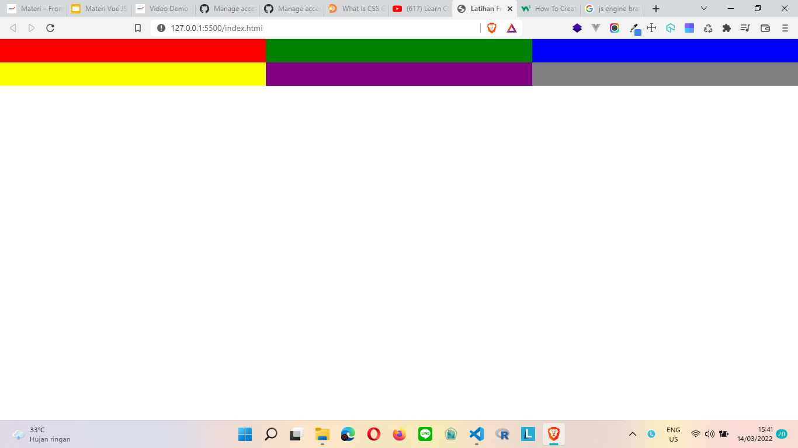
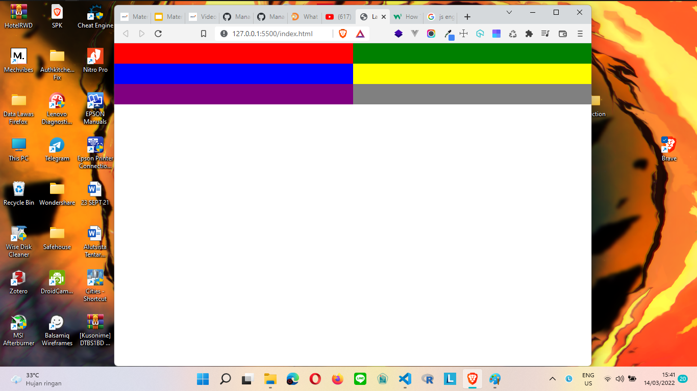
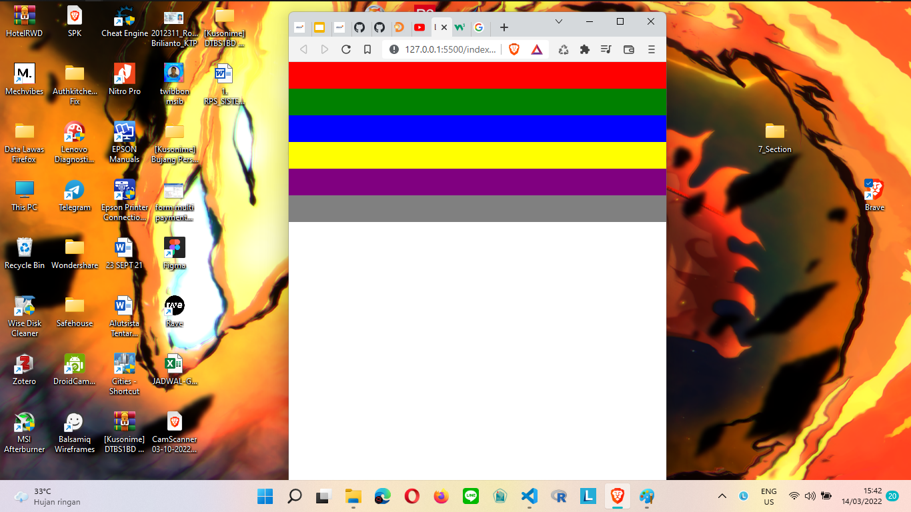

# (10) Frontend Fundamental

Karena dimateri ini banyak materi yang diulang, maka saya akan memasukan materi yang belum pernah dibahas sebelumnya

## Javascript

### Engine

Sekarang Javascript bisa berjalan tidak hanya pada browser, tapi juga bisa di server. berikut nama engine javascript tiap browser:

1. Chrome

- V8

2. Firefox

- SpiderMonkey

3. Brave

- Blink

4. Diluar Web Browser

- Node JS

## NodeJS

### Definisi

Node JS adalah runtime environment untuk javascript dengan node js, kita bisa menjalankan kode javascript dimanapun tidak terbatas pada browser.

### Cara Kerja Node JS

Dengan cara melakukan eksekusi atau menjalankan file yang memiliki ekstensi .js

## NPM

### Definisi

singkatan dari Node Package Module yang merupakan tool command line yang dapat menginstall dan menguninstall package, mengelola versi dan dependensi yang di perlukan untuk menjalanlan proyek.

# TASK

untuk tugas kali ini kita diminta untuk membuat css sesuai di ppt  pada slide ke 62 dan 63

berikut hasil outputnya

1. 
2. 
3. 
