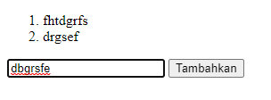
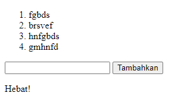

# (11) Vue Fundamental

## Definisi

Vue adalah framework javascript progressiv yang digunakan untuk pengembangan tampilan website yang lebih dinamis

## Directive

directive adalah atribut khusus vue yang diawali dengan v-, directive berfungsi untuk menjalankan satu perintah atau ekspresi javascript di dalam atribut.

contoh directive:

### 1. v-bind

digunakan untuk mengikat data 1 arah (one way data binding)

### 2. v-model

digunakan untuk mengikat data 2 arah (two way data binding)

### 3. v-if, v-else-if, v-else

untuk melakukan rendering secara kondisional pada atribut

### 4. v-on

untuk melakukan event atau fungsi

### 5. v-for

untuk melakukan pengulangan

## Component

component adalah vue instance yang dapat digunakan kembali dengan nama yang kita definisikan. kita bisa menggunakan component ini sebagai kustom element di dalam instance root vue yang dibuat new vue.
contoh:
JS

```
Vue.component('component-a', { /* ... */ })
Vue.component('component-b', { /* ... */ })
Vue.component('component-c', { /* ... */ })

new Vue({ el: '#app' })
```

HTML

```
<div id="app">
  <component-a></component-a>
  <component-b></component-b>
  <component-c></component-c>
</div>
```

# TASK

untuk tugas kali ini kita disuruh meniru input yang ada di ppt [ini](https://docs.google.com/presentation/d/1CQyqAjPOLZLkaZbcZMwYMxD0LMqhrJDuOX8GvkICBXo/edit) pada slide ke 46

berikut screenshotnya:

1. 
2. 
