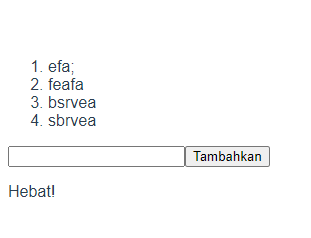
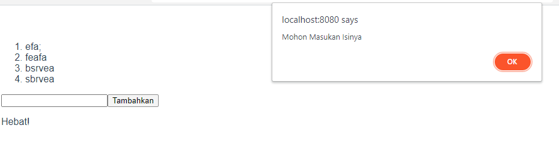

# (12) Vue CLI

## Definsi

Vue CLI adalah perkakas standar untuk memudahkan penyetelan/pembuatan aplikasi vue baru.

## Cara Pasang

untuk menginstall vue CLI bisa dengan perintah

```
npm install -g @vue/cli
```

untuk menginisialisasi project, bisa dengan Syntax

```
vue create <nama project>
```

atau jika ingin menginisialisasi project langsung tanpa membuat folder, bisa dengan Syntax

```
vue create .
```

untuk menjalankan app versi development bisa dengan Syntax

```
npm run serve
```

untuk versi production bisa dengan Syntax

```
npm run build
```

## Komponen Tunggal

memungkinkan kita membangun seluruh komponen dalam satu file.
terdiri dari

```
<template>
</template>

<script>
</script>

<style>
</style>
```

1. template sama seperti HTML body
2. script memuat syntax js
3. style memuat css

# TASK

untuk tugas kali ini kita disuruh mengikuti kondisi di ppt slide [ini](https://docs.google.com/presentation/d/1SGDHAsNaPXbkd66lXYYcG_rhYIFk15Zsawebq96QPz0/edit) slide ke 36

berikut screenshotnya

1. 
2. 
