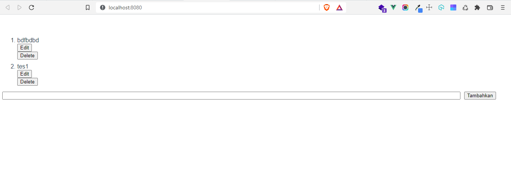
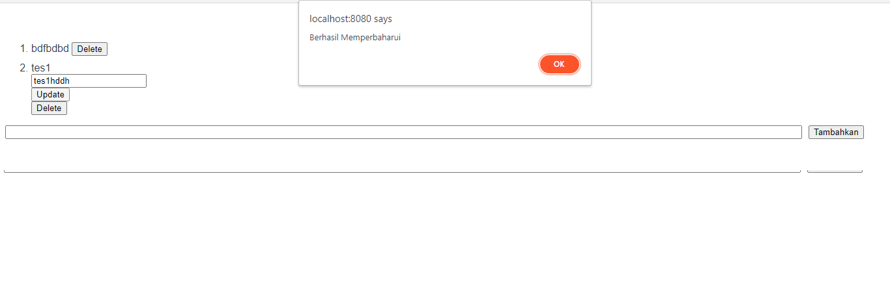
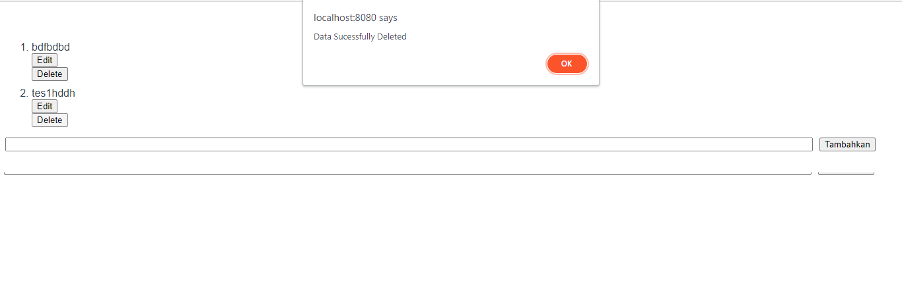
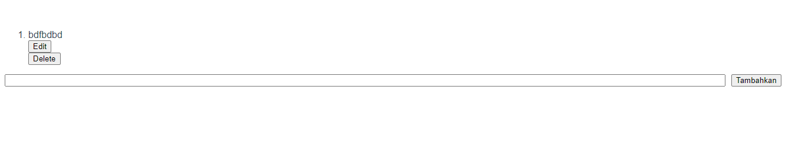

# (13) Komponen Vue

## Module

modul berisi kelas atau pustaka fungsi untuk tujuan tertentu
modul hanya sebuah file.

## Komunikasi antar komponen

- Props
  untuk mengekspos data berupa variabel antar komponen.

- Emit
  untuk mengekspos data berupa fungsi antar komponen.

## Vue Lifecycle

siklus hidup vue berawal dari inisiasi sampai penghancuran
setiap siklus memiliki hook nya masing2 yang berbentuk fungsi

1. Created()
   berlangsung setelah instance terbentuk dan sebelum DOM dirender

2. Mounted()
   Berlangsung setelah DOM dirender

3. Destroyed()
   berlangsung sebelum instance dihancurkan.

# TASK

pada task kali ini saya minta membuat todo list dengan fungsi CRUD lengkap seperti di ppt [ini](https://docs.google.com/presentation/d/1KIhWsgRK6vFb41QHK4jdK1ZGMhgPKfRMiihdQJrUY2o/edit#slide=id.g1100d442a0c_0_36) slide ke 43-45

berikut hasil dari [tugasnya](praktikum/)

berikut ss nya

1. 
2. 
3. 
4. 
