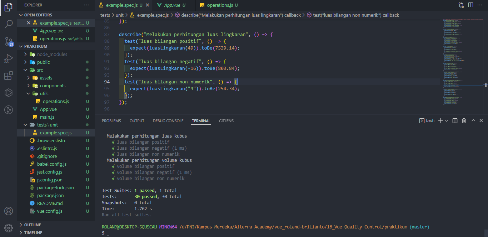
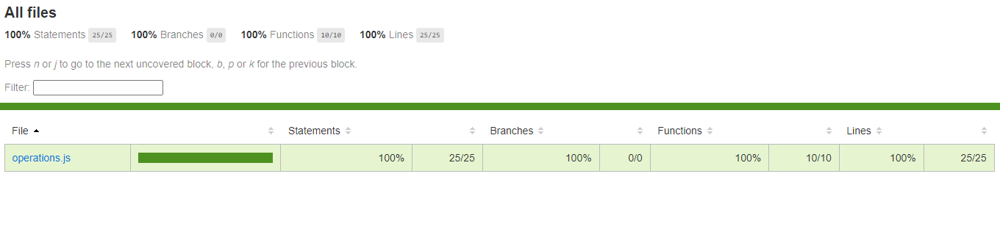
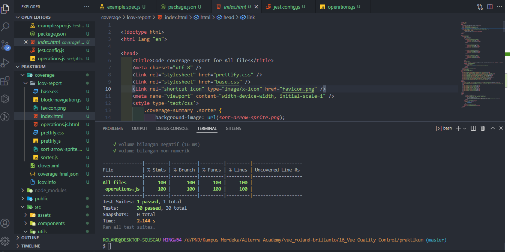

# (16) Vue Quality Control

## Debugging

adalah proses mengidentifikasi dan menghilangkan kesalahan dari perangkat lunak komputer

## Unit Testing

adalah proses verifikasi bahwa kode ktia benar benar berperilaku seperti yang diharapkan dan validasi bahwa kode kita tetap benar sepanjang masa aplikasi

### - Cara kerja

Unit testing memberikan kita kesempatan untuk menguji potongan kide secara individual dan terisolasi dalam bentuk test assertion.

### Test Assertion

adalah ekspresi boolean yang mengembalikan nilai true kecuali ada kesalahan atau perilaku yang tidak diharapkan kode kita.
pada umumnya unit testing memakai pustaka kerja pendukung seperti Jest atau Mocha.

## Matriks Ukur Kinerja

adalah tolak ukur penting yang menunjukan seberapa baik kinerja apliaksi kita.

### - Cara kerja

dengan bantuan perkakas yang menjalankan serangkaian pemeriksaan sebelum menghasilkan laporan terperinci terkait skor seberapa baik kinerja halaman.

# TASK

Tugas nya merupakan menjalankan testing beberapa operasi yang detilnya ada di slide 40 ppt [ini](https://docs.google.com/presentation/d/1veu9XSBwcXoD1J6u3KE7GorY8M1o0giQ6g_pf712WYY/edit)

berikut hasil source code nya

1. [testing](praktikum/tests/unit/example.spec.js)
2. [operation](praktikum/src/utils/operations.js)

berikut ss nya

1. 
2. 
3. 
