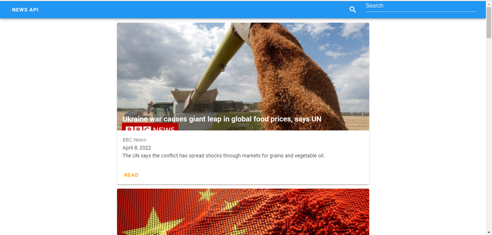
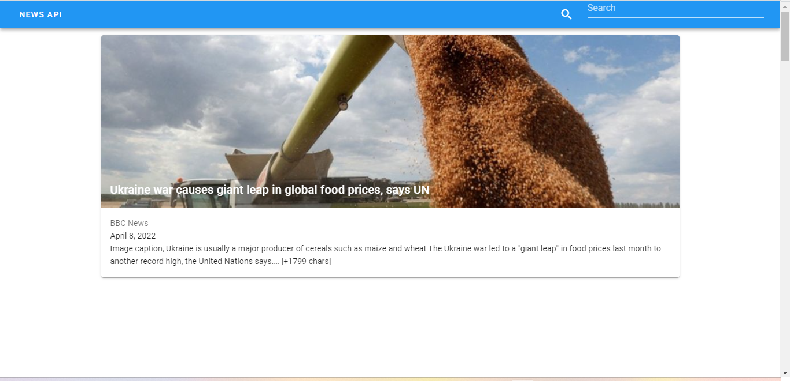

# (17) Vue UI Framework

## UI Framework

- Adalah kumpulan elemen visual dan fungsionalitas yang bisa dipakai secara instan.
- UI Framework membantu untuk membuat aplikasi web dengan tampilan yang baik dan terlihat profesional

## vuetify

- adalah library yang memungkinkan kita membuat apliaksi dengan tampilan yang indah walaupun kita bukan seorang desainer

- vuetify memiliki lebih dari 80 komponen berbasis material design yang mana komponen tersebut dapat membantu kita lebih cepat dalam pengembangan aplikasi

## Manajemen Warna tema

- pengaturan set warna yang dapat kita terapkan terhadap tampilan di aplikasi.

- vuetify menyimpan warna tema bawaan yang bisa kita setel secara manual ketika aplikasi berjalan. komponen vuetify menggunakan warna primary sebagai warna utamanya.

# TASK

tugasnya adalah mengubah tampilan vue data menggunakan vuetify sesuai ppt  pada slide ke 51

Hasil:
berikut hasil outputnya

1. [hasil](praktikum/src/)

dan ini screenshot nya

1. 
2. 
