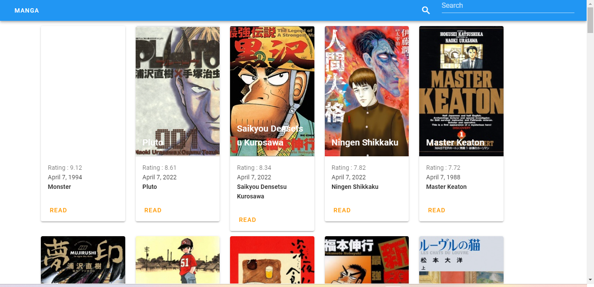

# (18) Work Together With Product - Backend and Devops

## Product Team

- tim product adalah sekelompok orang yang mengawasi proses desain produk baru

- setiap anggota tim berkolaborasi dengan yang lain untuk menerapkan strategi

Anggota:

1. Product Management
2. UX
3. UI

## Backend Team

- pengembangan backend mengacu pada pengembangan sisi server yang berfokus pada database, scripting dan arsitektur situs web.

- kode yang ditulis oleh pengembangan backend membantu browser untuk berkomunikasi dengan database

## Devops

- Tim yang bertujuan untuk mempersingkat siklus hidup pengembangan sistem dan menyediakan pengiriman berkelanjutan dengan kualitas perangkat lunak tinggi.
  Secara singkat tim devops yang bertanggung jawab dalam deployment.

# TASK

tugas kali ini disuruh untuk melakukan deploy men tugas kemarin, namun karna news api tidak bisa untuk di deploy, jadi saya memakai anime api.

Hasilnya ada disini:

1. [netlify](https://roland-altera-vuejs.netlify.app/#/)

dan berikut ss nya

1. 
2. 
