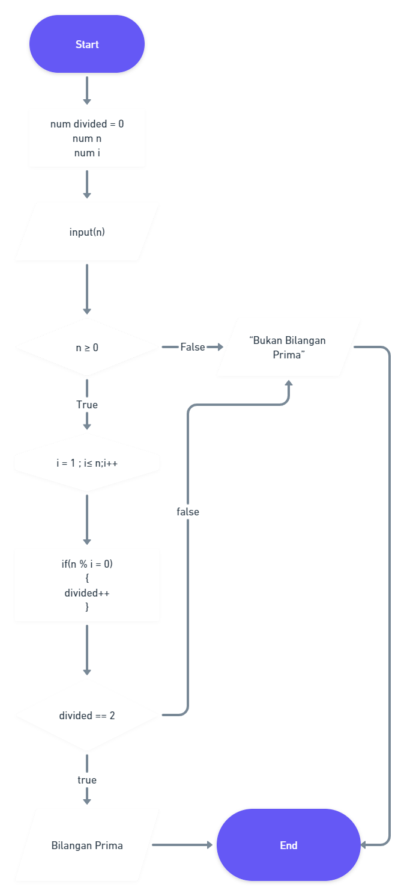
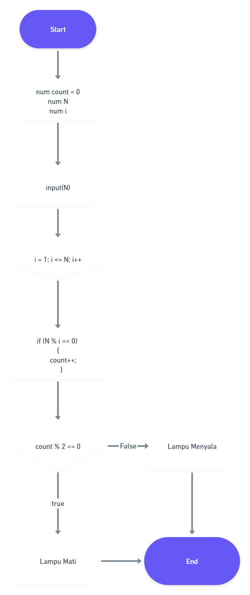

# (20) Introduction Algorithm

## Algoritma

adalah prosedur komputasi yang di definisikan dengan baik yang mengambil beberapa nilai sebagai input menghasilkan beberapa nilai sebagai output.

## Flowchart

adalah suatu bagan dengan simbol tertentu yang menggambarkan urutan dan hubungan antar proses secara detail.

## Pseudocode

Pseudocode dapat diartikan sebagai deskripsi dari algoritma pemrograman yang dituliskan secara sederhana dibandingkan dengan sintaksis bahasa pemrograman. Tujuannya, agar lebih mudah dibaca dan dipahami manusia.

# TASK

untuk tugas, kita diminta membuat flowchart berdasarkan soal [ini](https://docs.google.com/document/d/1QEwLv53ARo-Gsl4URZfZ9v1e6rDpK9lQn6XdswkgV7A/edit#)

berikut hasil nya

1. [Bilangan Prima](https://whimsical.com/bilangan-prima-68ApTNZpx88MN7KNDjMsip)

2. [Lampu](https://whimsical.com/lampu-6ADu5QC9AnnKxpoJS788Uz)

berikut screenshot nya

1. 
2. 
