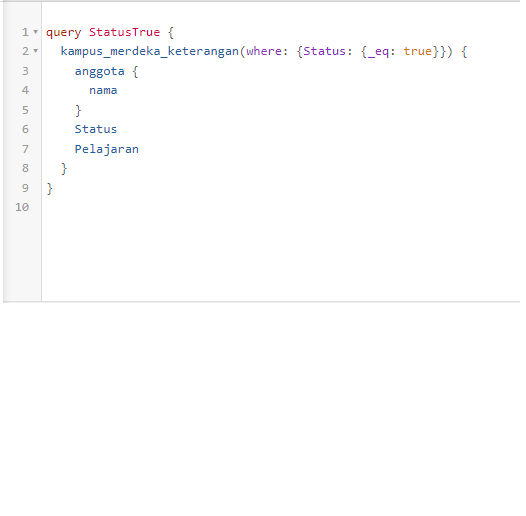
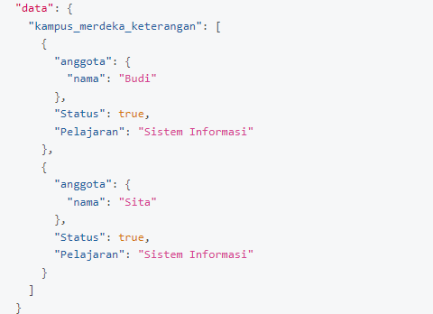
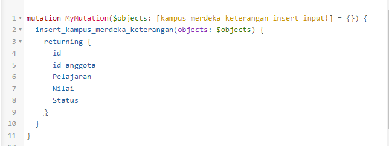
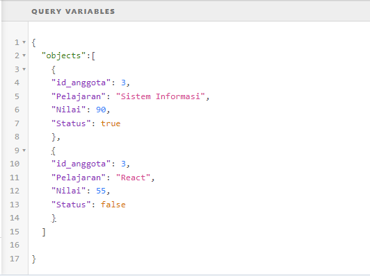
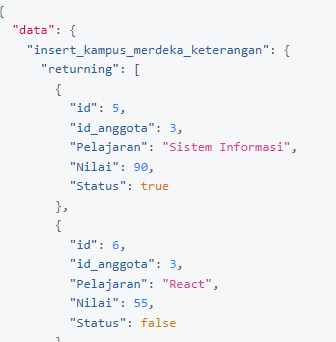
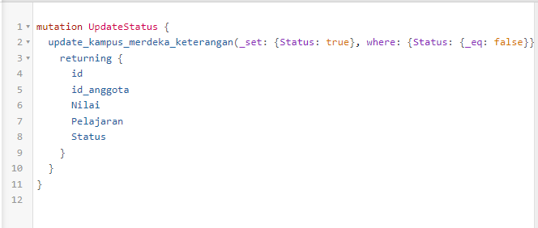
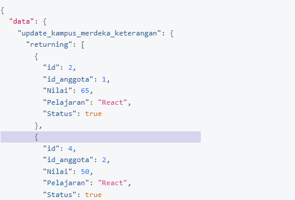
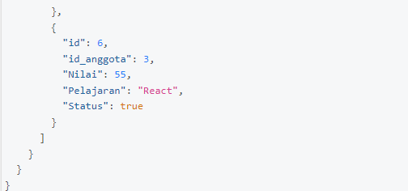

# (21) Understanding GraphQL Basic

## GraphQL

- adalah bahasa query untuk API kita dan sebuah runtime server-side untuk mengeksekusi query dengan system stype yang telah terdefinisikan dalam data.

- GraphQL meminimalisasi jumlah data yang perlu di transfer dalam Jaringan

- Ada 3 Fitur Utama GraphQL

### - Query

digunakan untuk mendapatkan data dari query spesifik yang kita tulis

### - Mutation

digunakan untuk insert, update, delete data

### - Subscription

untuk mendapatkan data terupdate (realtime) berdasarkan event

# TASK

untuk tugas kali ini kita diminta membuat table dengan database heroku serta manajemen query GraphQL menggunakan Hasura. untuk detil nya bisa dilihat [disini](https://docs.google.com/document/d/1JFNrbzTj03DPHLANU_SXRf6eg5ENRC8g9V37WRlW9Tw/edit)

berikut adalah hasil praktikumnya:

1. [praktikum](praktikum/praktikum.json)

dan ini screenshot nya

1. 
2. 
3. 
4. 
5. 
6. 
7. 
8. 
