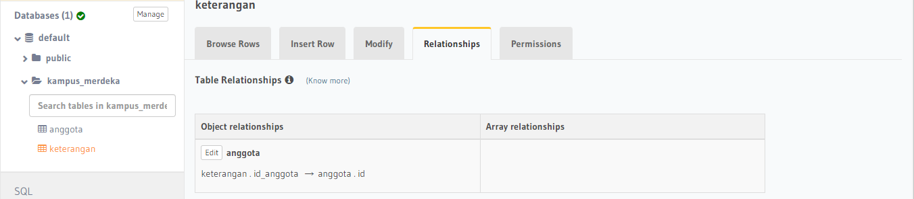
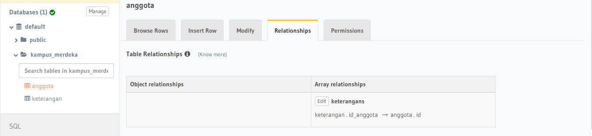

# (22) Relational Database

# RDBMS

Adalah software yang menggunakan Relational Database Model sebagai dasarnya

- contoh : MySQL

# Perintah SQL

## DDL

Adalah sekumpulan perintah untuk mendefinisikan sesuatu seperti membuat tabel

- contoh perintah DDL:

1. CREATE
2. DROP
3. ALTER

## DML

adalah sekumpulan perintah untuk memanipulasi data dalam tabel database

- contoh:

1. INSERT INTO
2. SELECT \* FROM
3. UPDATE
4. DELETE

## DCL

adalah salah satu dari kelompok perintah SQL yang digunakan untuk melakukan kontrol terhadap privilege atau hak akses khusus untuk berinteraksi dengan database.

- contoh:

1. GRANT
2. REVOKE

# Join

Adalah sebuah klausa untuk mengkombinasikan record dari dua atau lebih tabel

- contoh:

1. LEFT JOIN
2. RIGHT JOIN
3. INNER JOIN

# TASK

untuk tugas kali ini kita diminta membuat relasi dari tabel anggota dan keterangan pada tugas kmren.

hasil:

1. One To One 
2. One To Many 
