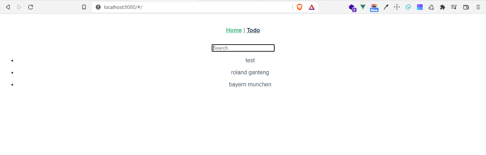

# (23) Understanding GraphQL Query

## Query

1. Query pada graphql digunakan untuk mengambil data sesuai dengan spesifikasi yang kita berikan.

- Ada 3 Jenis Query

## 1. Query Biasa

```
query{
    movies{
        id
        title
    }
}
```

## 2. Multiple Related Data

pada dasarnya adalah query untuk mendapatkan 2 data yang saling berkaitan dalam 1 relasi

```
query{
    movies{
        id
        title
        director{
            name
            age
        }
    }
}
```

## 3. Multiple Unrelated Data

pada dasarnya adalah query untuk mendapatkan 2 data namun tidak saling berhubungan 1 sama lain

```
query{
    movies{
        id
        title

    }
    books{
        id
        title
    }
}
```

# TASK

Tugas kali ini kita diminta membuat query menampilkan todo dan memberikan fitur search detilnya [disini](https://docs.google.com/document/d/1adlkVrgw52__qGZdXFAJoCuCCA0xCq8tSyArmNAjeOY/edit?usp=sharing)

- berikut [hasilnya](praktikum/)

- dan ini screenshotsnya:

1. 
1. 
