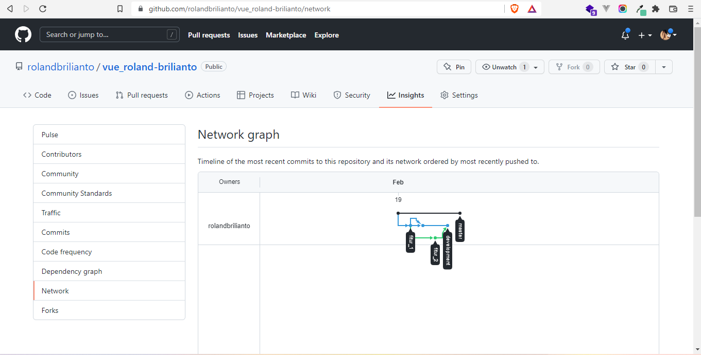

# (2) Version Control and Branch Management (Git)
## Definisi
Git adalah sebuah Version kontrol sistem dimana para programmer dapat bekerja secara collaborative

## Pedoman
jika ingin menambahkan fitur, ada baiknya dilakukan di branch fitur dimana branch tersebut akan di merge ke branch develop

## Syntax
ada banyak sekali syntax git yaitu:
1. git add
2. git branch
3. git commit -m "(messsage)"
4. git push -u origin (nama branch)

# TASK
1. Pada task ini, kita diharuskan membuat branch development, lalu membuat 2 branching lagi dari development dan menambahkan fitur di 2 branching tersebut lalu di merge kedalam development.

berikut kode dari praktikum ini.
[index.html](praktikum/index.html)

network insight nya:

