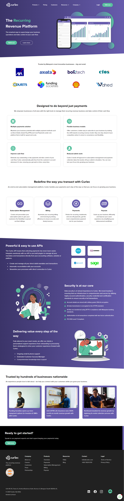
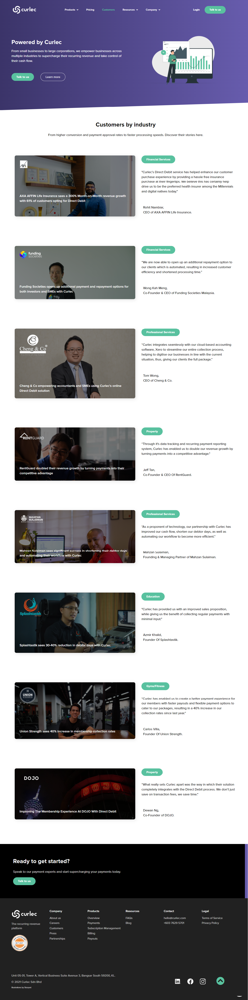
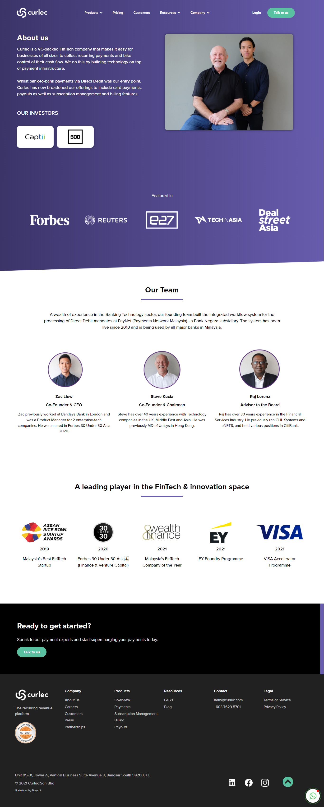

# (3) Introduction UI dan UX

## UX

adalah apapun yang pengguna rasakan ketika menggunakan aplikasi kita UX terdiri dari 6 bagian

1. Business Logic
2. Technology
3. Interaction Logic
4. Design
5. Computer Communication
6. Business

### Tahapan UX Design

- Empathize
  Berpura pura melihat dunia dari pov user, menghargai user, sehingga komunikasi berjalan lancar dan membuat sesuatu yang dinamakan user persona yaitu profile dari user kita.

- Define menggunakan semua info dari empathize. memprioritaskan info2 sehingga menemukan masalah inti agar dapat lebih focus mengembangkan ux.

- Ideate
  memiliki beberapa tahap yaitu

1. user goal
   yang berisi user flow setiap langkah user.
2. task flow
   yaitu step step user sampai menuju goal nya.
3. wireflow
   yaitu kombinasi wireframe dan flowchart.

## UI

adalah visual yang user gunakan ketika berinteraksi dengan aplikasi

memiliki 4 pillar :

1. Konsistensi
2. Simple
3. Good Typography
4. Informative Feedback

## PROTOTYPE

tujuannya adalah agar mendapat feedback dari user maupun stakeholder sehingga bisa memperbaiki dan memberi masukan terkait aplikasi sehingga terciptanya interaksi yang baik agar memudahkan pengembangan project.

3 pillar prototype

1. representation
2. precision
3. interactivity

# TASK
1. pada task ui ux diminta mencari desain dengan tema bebas, lalu jabarkan bagian2 pada halaman web tersebut serta menguraikan fitur ui ux serta color pallet nya

berikut hasil praktikumnya 
[praktikum ui ux](https://docs.google.com/document/d/1kiFFmzz8GhWJCJU0cME4y49PhnE1CmZJ/edit?usp=sharing&ouid=101315359720987096596&rtpof=true&sd=true)

berikut tampilannya
home page

customer page

about us

