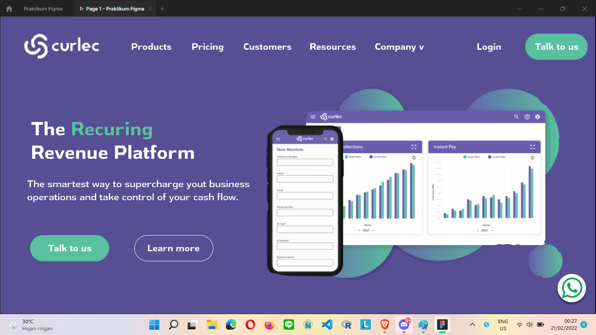

# (4) Figma

### Definisi

Figma adalah a vector graphics editor dan prototyping tool yang utamanya berbasis web, dengan tambahan fitur offline di aplikasi desktop.

### Keuntungan

- Gratis
- berjalan di windows dan mac
- Real-time team collaboration,
- Integrated high-quality prototyping

### Kelemahan

harus online saat ingin bekerja. tapi kita bisa menyimpan progressnya di local

# TASK
1. taks figma kali ini adalah membuat desain sesuai yang kita pilih saat materi ui ux, serta buatkan prototype nya.

berikut link [figma nya](https://www.figma.com/file/Tx6NLaRUyd2jDHGobYFYRN/Praktikum-Figma?node-id=0%3A1)

dan ini adalah sneak peek dari figma tersebut

