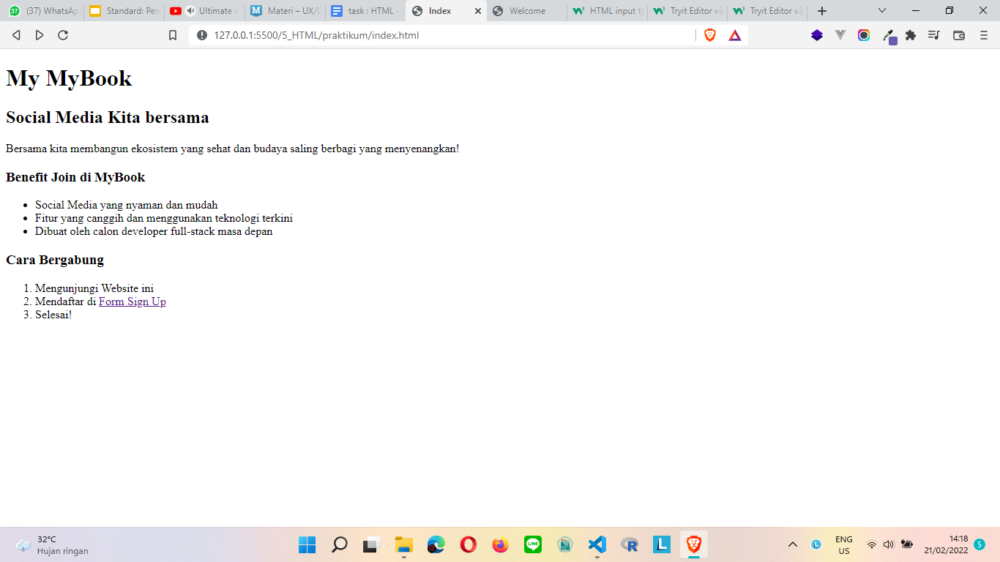
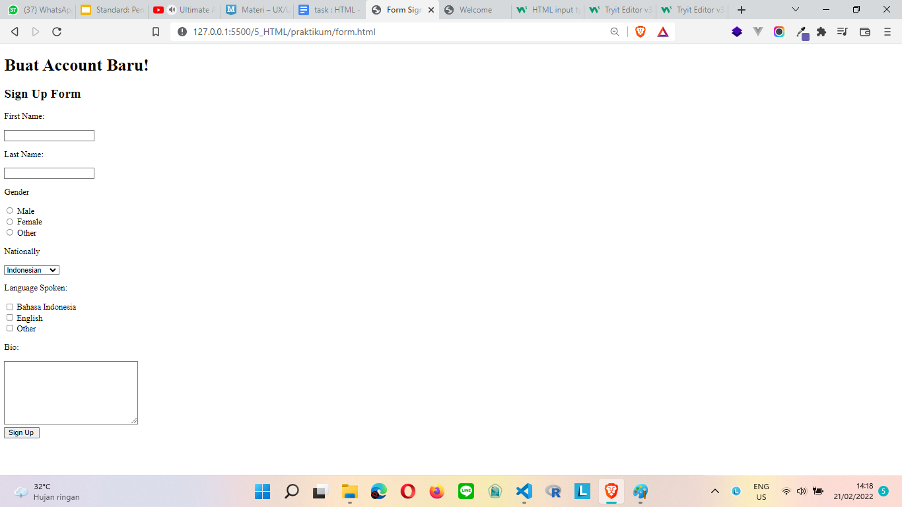
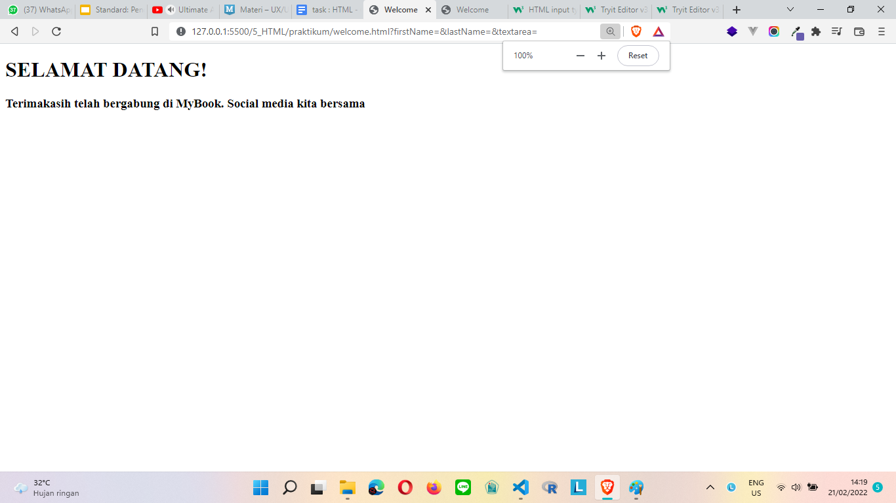

# (5) HTML

## Definisi HTML

HTML adalah singkatan dari HyperText Markup Language, adalah sebuah standar yang digunakan dalam membuat web.

### Kegunaan HTML

- Membuat struktur halaman web page
- mengatur tampilan dan isi halaman web page
- membuat form dengan tag form
- membuat sebuah list dengan ol, ul, li
- mempublikasikan web secara online

## Definisi Frontend

Frontend adalah sebuah bagian dari website yang membuat tampilan yang menarik kepada user.

# TASK
1. tugas kali ini adalah membuat halaman web html yang nanti akan menavigasi ke form.html lalu ke welcome.html

berikut [hasilnya](praktikum/index.html)

berikut outputnya 
index

form

welcome

