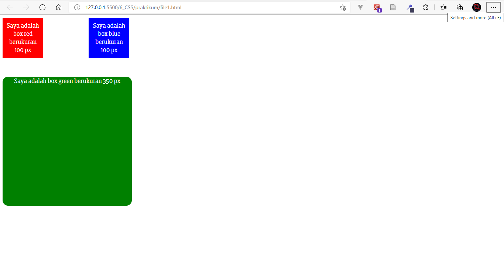
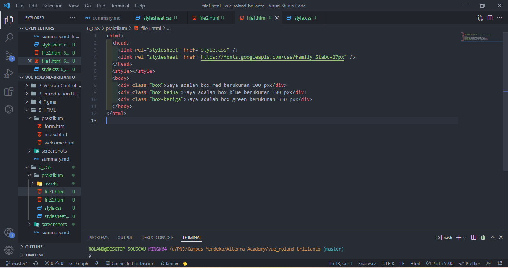
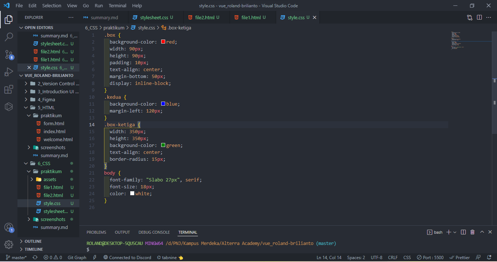
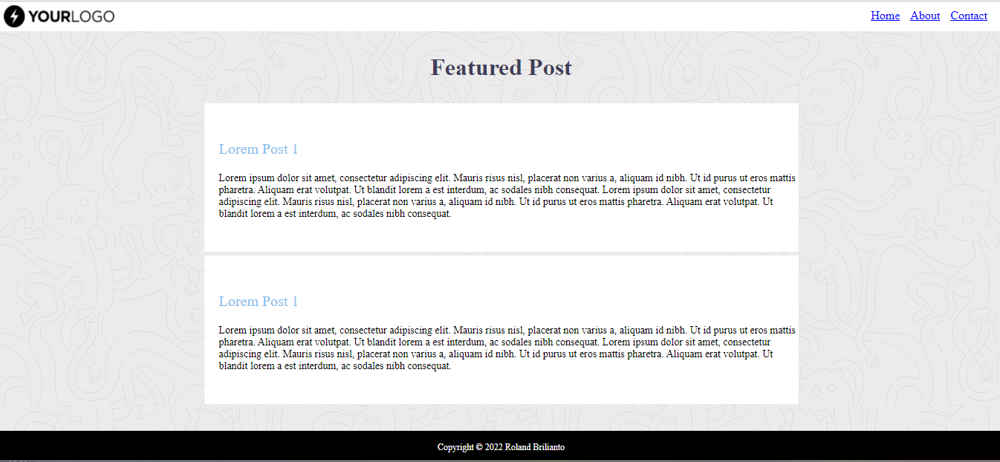
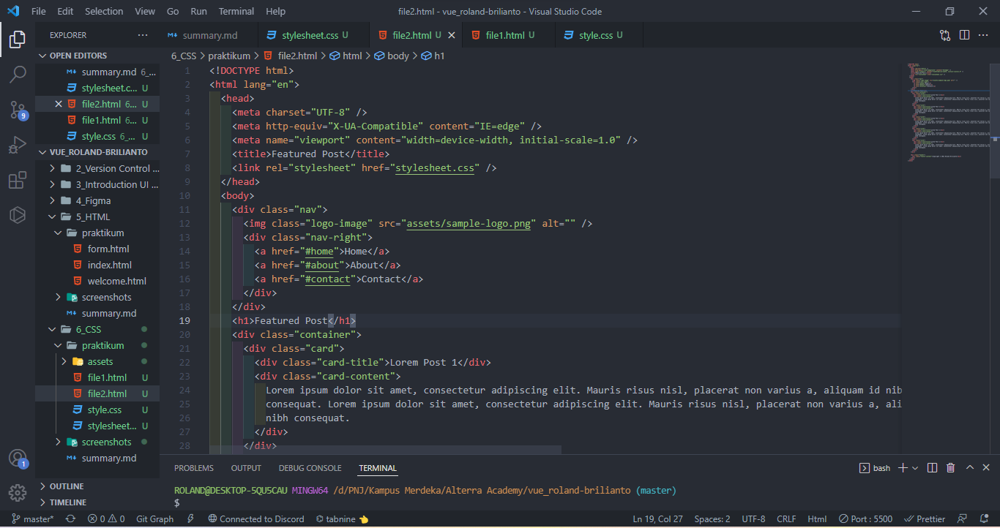
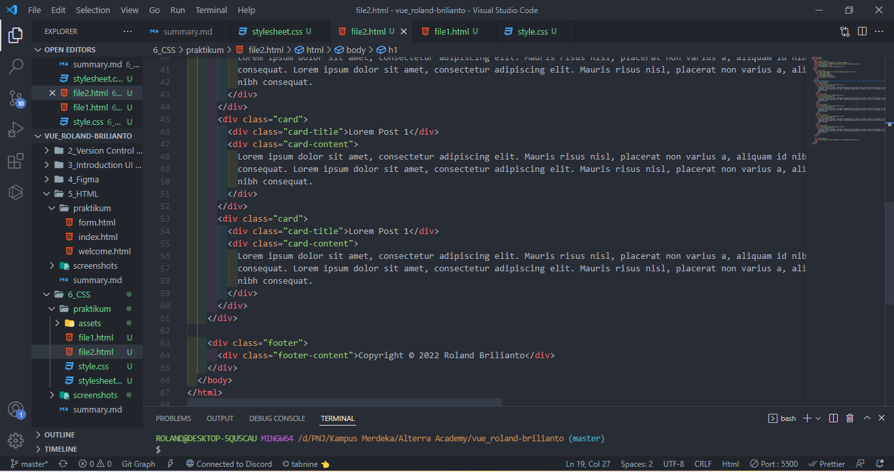
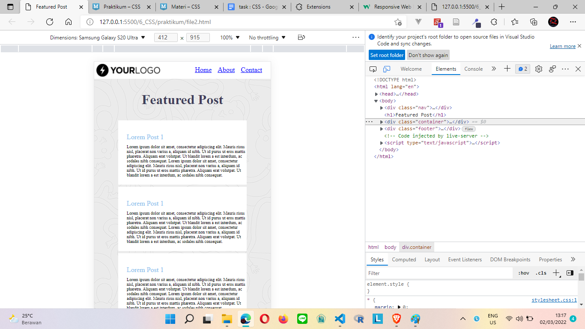
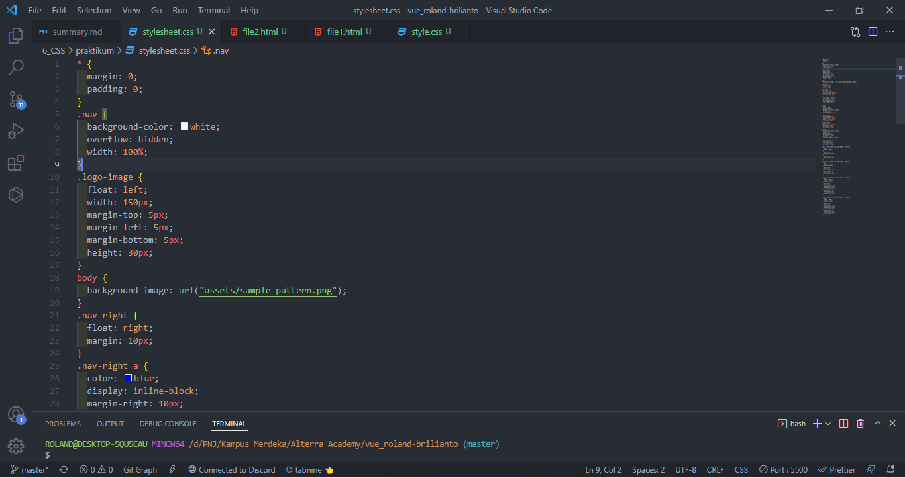
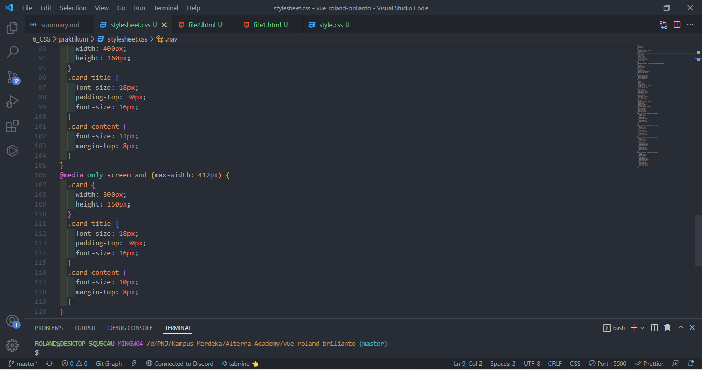

# (6) CSS

## Definisi

CSS adalah singkatan dari Cascading Style Sheets yang memiliki fungsi untuk menghias website dan mengatur layouting pada website.

## 3 Cara menaruh css

1. Internal

```
<head>
<style>
body {
  background-color: linen;
}

h1 {
  color: maroon;
  margin-left: 40px;
}
</style>
</head>
```

2. Inline

```
<body>

<h1 style="color:blue;text-align:center;">This is a heading</h1>
<p style="color:red;">This is a paragraph.</p>

</body>
```

3. External
   index.html

```
<!DOCTYPE html>
<html>
<head>
<link rel="stylesheet" href="mystyle.css">
</head>
<body>

<h1>This is a heading</h1>
<p>This is a paragraph.</p>

</body>
</html>
```

mystyle.css

```
body {
  background-color: lightblue;
}

h1 {
  color: navy;
  margin-left: 20px;
}
```

## CSS Selectors

1. Element

```
p {

}
h1 {

}
```

2. Class

```
.container{

}
.card{

}
```

3. Id

```
#header {

}

#carousel {

}
```
# TASK
Tugas kali ini adalah mereplika desain yang ada di [sini](https://docs.google.com/document/d/1RFrqbkqwNSf9vWmV2ujNNlm0MWbZhXOrzi0H6yplXZk/edit).

berikut hasilnya:
1. [file1](praktikum/file1.html)
2. [css file 1](praktikum/style.css)
3. [file2](praktikum/file1.html)
4. [css file 2](praktikum/stylesheet.css)

berikut output screenshoots nya
1. 
2. 
3. 
4. 
5. 
6. 
7. 
8. 
9. 
