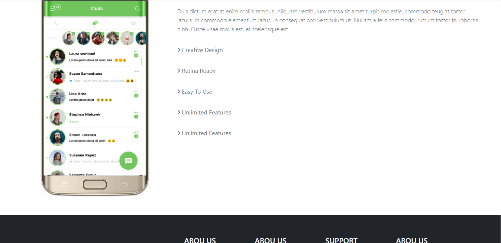

# (7) Bootstrap

## Frontend Framework

adalah sekumpulan aturan kode yang bisa kita gunakan untuk mempermudah dalam pembuatan suatu tampilan website.

## Kenapa Bootstrap?

- Gratis
- Mudah dipelajari
- Cepat
- Responsive

## Class pada bootstrap

- container
- row
- coloumn
- button

# TASK

pada tugas kali ini, kita diminta menirukan layout [link ini ](https://docs.google.com/document/d/1HlS8tK1b8HfobjdVQELTFv_GCKAkMOpjKXm9vYLSaw4/edit)dengan menggunakan bootstrap.

berikut kodingan hasilnya:

berikut hasil outputnya:

