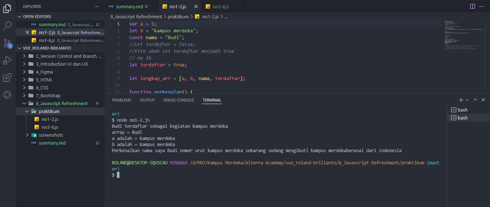
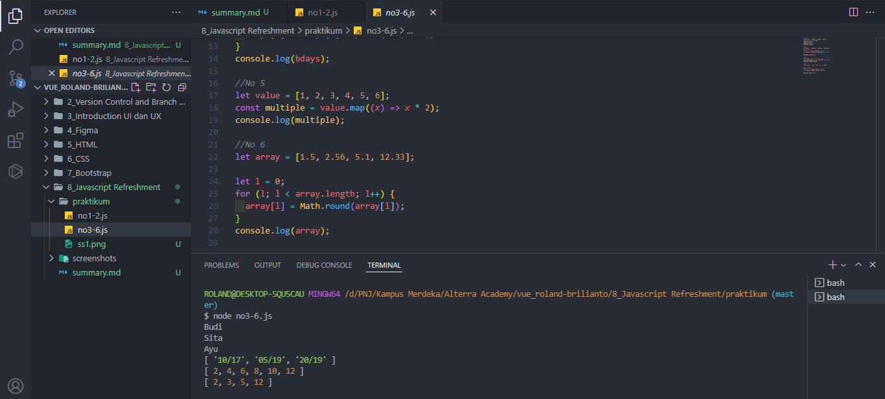

# (8) Javascript Refreshment

## Definisi

Javascript adalah bahasa pemograman yang high-level, scripting, Untyped dan Interpreted.

## Tipe data

JS Memiliki 2 kategori tipe data :

1. Primitives:
   Unit pemrosesan terkecil dan elemen paling sederhana yang tersedia dalam bahasa pemograman.
   contoh:

- String
- Boolean
- number
- BigInt
- Undefined
- Null
- Symbol

2. Object:
   Unit yang menyimpan property dan fungsi(method)
   Contoh:

- Object
- Array
- Function
- Date
- Set
- Map
- Weak Set
- Weak Map

## Method

method merupakan sebuah fungsi yang terkait dengan object, membuat programnya se-sederhana mungkin sesuai keinginan masing-masing.
contoh:

1. Concat
   Menggabungkan dua atau lebih array, dan mengembalikan salinan array yang digabungkan.

2. Map
   Membuat array baru dengan hasil memanggil fungsi untuk setiap element array.

3. Foreach
   Memanggil fungsi untuk setiap element array

4. Slice
   memilih bagian dari array, mengembalikan array baru

5. Filter
   membuat array baru dengan setiap element dalam array lulus seleksi

6. reduce
   melakukan operasi pada setiap element array menjadi nilai tunggal (dari kiri ke kanan)

# TASK

pada tugas kali ini, kita diminta menyelesaikan persoalan di [link ini ](https://docs.google.com/document/d/1Ke6H5HerrxYGt6QuDHtCCbqQwPUFcgGLoFI1a0n-6D8/edit)

berikut kodingan hasilnya:

berikut hasil outputnya:

